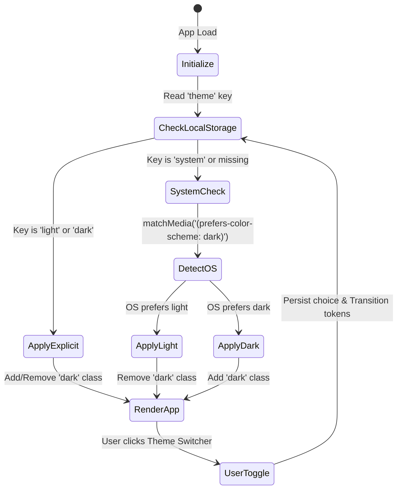
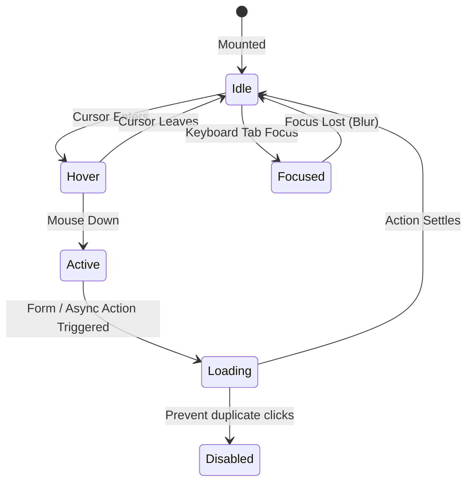

# Data Model: UI Design Tokens & Component System

**Feature**: UI Redesign with Design Tokens and Reusable Component Architecture  
**Branch**: `003-ui-shadcn-tokens`  
**Status**: Completed  

---

## 1. Entities & Types

### 1.1 DesignTokenDefinition

Represents a defined visual attribute in the design system.

```typescript
export type TokenCategory =
  | "color"
  | "typography"
  | "spacing"
  | "radius"
  | "shadow"
  | "z-index"
  | "motion";

export interface DesignTokenDefinition {
  name: string;              // e.g. "--primary", "--radius"
  category: TokenCategory;
  description: string;
  lightValue: string;        // HSL or rem string
  darkValue: string;         // HSL or rem string
  wcagContrastRatio?: number; // Minimum contrast ratio against corresponding background
}
```

### 1.2 ThemePreference

Represents the user's active or preferred display theme.

```typescript
export type ThemeMode = "light" | "dark" | "system";

export interface ThemeState {
  theme: ThemeMode;          // User selection persisted in localStorage
  resolvedTheme: "light" | "dark"; // Currently rendered theme after system check
  setTheme: (theme: ThemeMode) => void;
}
```

### 1.3 UIComponentVariant

Defines the structure and allowable properties for standard UI component primitives.

```typescript
export type ButtonVariant =
  | "default"
  | "destructive"
  | "outline"
  | "secondary"
  | "ghost"
  | "link"
  | "agent";

export type ButtonSize = "default" | "sm" | "lg" | "icon";

export interface ButtonProps extends React.ButtonHTMLAttributes<HTMLButtonElement> {
  variant?: ButtonVariant;
  size?: ButtonSize;
  asChild?: boolean;
  isLoading?: boolean;
  leftIcon?: React.ReactNode;
  rightIcon?: React.ReactNode;
}

export type BadgeVariant =
  | "default"
  | "secondary"
  | "destructive"
  | "outline"
  | "success"
  | "warning"
  | "agent";

export interface BadgeProps extends React.HTMLAttributes<HTMLDivElement> {
  variant?: BadgeVariant;
}
```

### 1.4 AgentAttributionMetadata

Captures origin details for AI agent contributions to render visually distinct badges and cards in accordance with Constitution Principle IV.

```typescript
export interface AgentAttributionMetadata {
  isAgentGenerated: boolean;
  agentId?: string;           // Identifier of the agent
  agentName?: string;         // Display name
  attributionType: "idea" | "enrichment" | "comment" | "summary";
  timestamp: string;          // ISO timestamp
  confidenceScore?: number;   // Optional confidence metric (0-1)
  verifiedByHuman?: boolean;  // Whether a human user has accepted or edited
}
```

### 1.5 ToastNotification

Represents an ephemeral notification informing the user of an action outcome.

```typescript
export type ToastType = "default" | "success" | "warning" | "destructive" | "agent";

export interface ToastNotification {
  id: string;
  title: string;
  description?: string;
  type: ToastType;
  duration?: number;          // Default 4000ms
  action?: {
    label: string;
    onClick: () => void;
  };
}
```

---

## 2. State Transitions & Lifecycle

### Theme State Transition


### Button State Transitions

